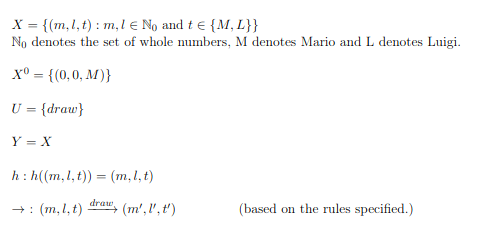

# Final Exam - 100 Points

## General Instructions
1. The test will be 120 minutes long in duration.
2. You are allowed to refer to the internet for official python documentation.
3. Make changes only in the relevant files. Do not alter any other file.
4. Adhere to the prescribed naming conventions and submission formats.
5. The questions are very unambiguous. In case you make any assumptions, mention them in the "ASSUMPTIONS" section of this README file. Specify the question number as well.

# Programming Section - 50 Points

## Question 1: Count Unique Letters - 10 Points
Write a function `count_unique_letters(s)` that takes a string `s` as an argument and returns the number of unique alphabetic characters in the string. The function should ignore case and count each letter only once, ignoring non-alphabetic characters.

---

## Question 2: Product of Odd Numbers - 10 Points
Write a function `product_of_odds(n)` that takes a natural number `n` as an argument. It returns the product of all odd natural numbers less than or equal to `n`. The function should be implemented using a loop.

---

## Question 3: Composing Functions for Speed Conversion - 20 Points
Write two functions: `mps_to_kph(mps)` that converts a speed `mps` from meters per second to kilometers per hour, and `kph_to_mph(kph)` that converts a speed `kph` from kilometers per hour to miles per hour. Then, write a third function `mps_to_mph(mps)` that composes these two functions to convert a speed from meters per second to miles per hour.

Given:

\[
\text{Kilometers per hour} = \text{Meters per second} \times 3.6
\]
\[
\text{Miles per hour} = \text{Kilometers per hour} \times 0.621371
\]

---

## Question 4: Function Returning an Even Check Function - 10 Points
Write a function `make_even_checker()` that returns a new function. The returned function should take a number `x` and return `True` if `x` is even, and `False` otherwise.

---


## Theory Section - 50 Points

### General Instructions

The following are multiple choice questions which need to be answered in the respective `.txt` files.

If the answer to:
- Q6.01 is option 1,
- Q6.02 is options 1, 2 and 3,
- Q6.03 is none of the options,
- Q6.04 is the number 4, and
- Q6.05 is "Banana".
your `Q6.txt` file should look like this:

```
Q6.01
1

Q6.02
1
2
3

Q6.03
None

Q6.04
4

Q6.05
Banana
```

Please pay attention to the format in which you need to answer.

---

### Question 5: Playing Cards with the Mario Brothers - 20 Points

Mario (M) and Luigi (L) are playing a card game with a standard deck of 52 playing cards. Mario always starts the game. Initially, both players have a score of 0.
The rules of the game are as follows:

Each turn, a player draws a card from the deck at random and then returns it (so cards can be drawn multiple times). The rules for the game are as follows:
1. _Face Cards (J,Q,K)_: If a player draws a face card, they add 10 to their score.
2. _Numeric Cards (2-10)_: If a player draws a numeric card, they add its value to their score.
3. _Aces_: If a player draws an ace, their score does not change.
4. _Black Cards (♠,♣)_: Drawing a black card earns the player another turn.
5. _Red Cards (♥,♦)_: If a red card is drawn, the other player takes the next turn.

The game continues until one player's score reaches or exceeds 21.
We can model this as a transition system. The states are of the form (m.l,t), where:

m denotes Mario's current score,
l denotes Luigi's current score, and
t denotes whose turn is next (M for Mario, L for Luigi).


Formally, the system can be defined as follows:



Any state that can be reached by starting from the initial state $(0,0,M)$ by following the aforementioned rules is a valid state.

#### Q5.01 - 5 Points
Which of these states can be reached from (5,18,M) in fewer than two transitions?

1. $(5,18,M)$
2. $(18,18,M)$
3. $(5,19,L)$
4. $(6,18,L)$
5. $(8,18,M)$

#### Q5.02 - 2 Points
What is the length of the shortest run possible in this system?

#### Q5.03 - 2 Points
What is the length of the shortest execution possible in this system?

#### Q5.04 - 2 Points
What is the length of the shortest completion possible in this system?

#### Q5.05 - 2 Points
There are no infinite runs possible in this system as the score of one player will eventually exceed 21. True or False?

#### Q5.06 - 2 Points
What is the length of the longest possible completion in this system, given that no card is drawn twice?

#### Q5.06 - 2 Points
Which of these are valid runs in this system?


---

### Question 6 - 30 Points

Given below is a simple program. Fill in the blanks to complete the execution model. (The blanks have been denoted by roman numerals in green.)


### Q6.01
What should come in the place of (i)?
1. `def g(w):`
2. `u = f(20)`
3. `y = x+2`
4. `return f`

### Q6.02
What should come in the place of (ii)?
1. 20
2. 26
3. 22
4. 10

### Q6.03
What should come in the place of (iii)?
1. `return f`
2. `return g`
3. `def g(w):`
4. `return x+w*y`

### Q6.04
What should come in the place of (iv)?
1. 22
2. 24
3. 240
4. 10

### Q6.05
What should come in the place of (v)?
1. $[e_T]$
2. $[e_6,e_5]$
3. $[e_6,e_5,e_T]$
4. $[e_T,e_6]$

### Q6.06
What should come in the place of (vi)?
1. `return g`
2. `return f`
3. `return x+w*y`
4. `return x+2`

### Q6.07
What should come in the place of (vii)?
1. 240
2. 420
3. 220
4. 200

### Q6.08
What should come in the place of (viii)?
1. $[k_6]$
2. $[k_6,k_5]$
3. $[k_5]$
4. $[\ ]$

### Q6.09
What should come in the place of (ix)?
1. {x:3, y:4}
2. {x:3, y:4, g:5}
3. {x:3, g:5}
4. { g:3, x:4, y:5}

### Q6.10
What should come in the place of (x)?
1. $(3,[e_5])$
2. $(3,[e_6,e_T])$
3. $(2,[e_5,e_T])$
4. $(2,[e_T])$

## ASSUMPTIONS
List out any assumptions you've made about the questions over here. Only valid assumptions will be considered.
